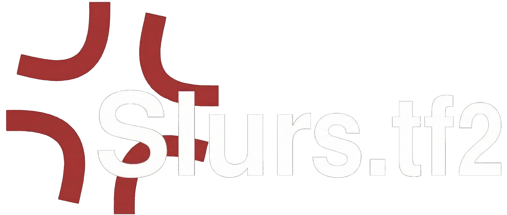

# Slurs-TF2

`Slurs-TF2` is a from-scratch replacement for the old [slurs.tf](https://slurs.tf/) player lookup site.

The original site got shutdown with its source code never being made public, and so I decided to make my own version!

This rebuild is usually slower than the original site because it scans logs live on demand instead of reading from a pre-populated backend database.

## What It Does

- Looks up a TF2 player by `SteamID64`
- Resolves vanity URLs when `STEAM_API_KEY` is configured
- Fetches logs live from [logs.tf](https://logs.tf/)
- Scans chat messages client-side after the shell loads
- Categorizes flagged messages with fuzzy matching for obfuscation and misspellings
- Tracks class usage from logs and shows the most-played class image
- Caches the last 10 completed player scans in the browser for faster revisits

## Data Sources

- `logs.tf` for log lists and log details
- Steam Web API for vanity resolution and player summaries when `STEAM_API_KEY` is present
- ETF2L for region fallback and profile fallback when Steam data is unavailable
- FlagCDN for flag rendering

## Stack

- Next.js 14 App Router
- TypeScript
- Tailwind CSS
- Vitest + Testing Library
- `sharp` for production image optimization

## Local Setup

### 1. Install dependencies

```bash
npm install
```

### 2. Configure environment variables

Create `.env.local` or populate `.env` with:

```bash
STEAM_API_KEY=your_steam_web_api_key_here
```

Steam keys can be created at:

`https://steamcommunity.com/dev/apikey`

### 3. Run in development

```bash
npm run dev
```

Open:

`http://localhost:3000`

## Steam Key Behavior

If `STEAM_API_KEY` is available:

- Vanity URL lookups are enabled
- Steam profile summaries are used directly

If `STEAM_API_KEY` is missing:

- Vanity URL lookup is disabled
- The home page only accepts `SteamID64`
- Profile fallback attempts to use ETF2L data where possible

## Production Build

```bash
npm run build
npm run start
```

## Local Public Tunnel

If you want to expose the local production build through Cloudflared:

```bash
npm run startp
```

That command:

- ensures a production build exists
- starts `next start`
- waits for the local port to be ready
- opens a Cloudflared tunnel to the local app

Optional environment variables:

- `PORT`
- `STARTP_HOST`
- `CLOUDFLARED_BIN`
- `STARTP_SKIP_BUILD=1`

This requires `cloudflared` to already be installed on the local machine.

## Vercel Deployment

### 1. Build locally first if you want to sanity check

```bash
npm run build
```

### 2. Deploy

```bash
npx vercel --prod
```

### 3. Add environment variables in Vercel

Set:

```bash
STEAM_API_KEY=your_steam_web_api_key_here
```

If you do not set the key, the app will still work for direct `SteamID64` lookups, but vanity URL resolution will remain disabled.

## Testing

```bash
npm test
```

## Project Structure

```text
app/
  api/
  player/[steamid]/
components/
lib/
public/
scripts/
tests/
types/
```

## Notes

- This project does not mirror any original private source code. It is a clean-room rebuild inspired by the public behavior of the old site.
- Upstream failures from `logs.tf` are retried, but they can still happen because the app depends on live external services.
- Cached player scans are client-side only and live in browser storage.

## Internal Documentation

Advanced repo documentation lives in:

- [.docs/README.md](c:/Users/TR/Desktop/projects/nodeJs/reslurs-tf/.docs/README.md)
- [.docs/architecture.md](c:/Users/TR/Desktop/projects/nodeJs/reslurs-tf/.docs/architecture.md)
- [.docs/runtime-and-data-flow.md](c:/Users/TR/Desktop/projects/nodeJs/reslurs-tf/.docs/runtime-and-data-flow.md)
